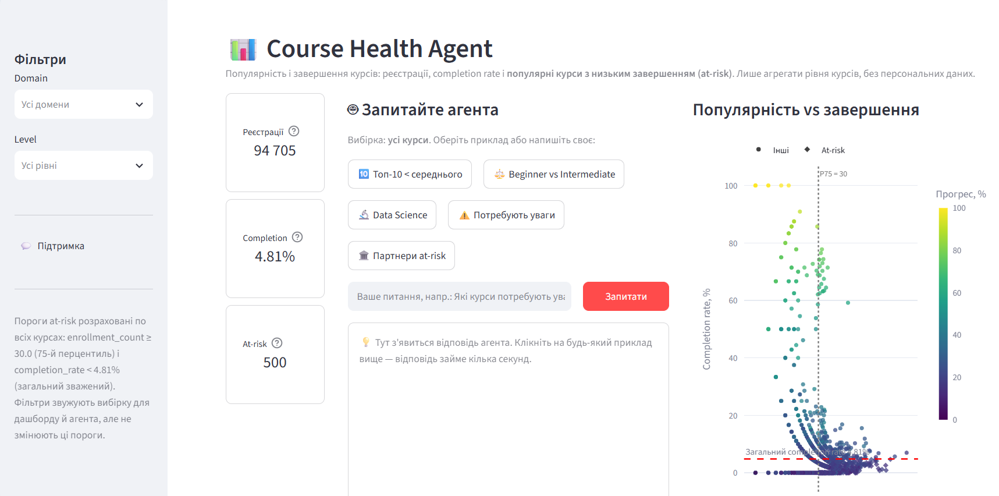
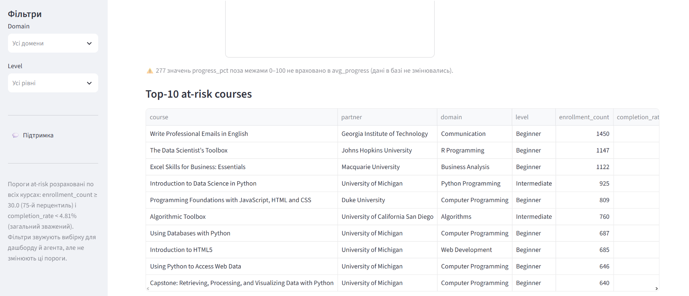

# 📊 Course Health Agent

## Мета проєкту

Навчальний проєкт (**Database → Agent → Analysis → Dashboard**). Він знаходить **популярні онлайн-курси з низьким рівнем завершення** (at-risk) і дає аналітичного агента, який українською відповідає на питання про популярність і завершення курсів.

Застосунок допомагає швидко побачити:
- скільки реєстрацій має кожен курс;
- яка частка реєстрацій закінчується сертифікатом;
- які популярні курси завершують гірше за середнє і потребують уваги.





## Архітектура

```
PostgreSQL ──► SQLAlchemy / Pandas ──► аналітичний агент (Gemini) ──► Streamlit
 (лише SELECT)   (метрики рівня курсу)   (лише агреговані дані)        (дашборд + чат)
```

| Файл | Роль |
|---|---|
| `queries.py` | Єдиний заздалегідь визначений SELECT-запит `course_metrics` і реєстр дозволених запитів `ALLOWED_QUERIES`. Рахує метрики кожного курсу та пороги at-risk. |
| `db.py` | Підключення через `DATABASE_URL` (SQLAlchemy + драйвер psycopg 3). Кожен запит виконується в транзакції `SET TRANSACTION READ ONLY` з таймаутом 30 с. Виконуються лише запити з `ALLOWED_QUERIES`; все, що не є `SELECT`/`WITH` або містить DML/DDL, відхиляється. Результат повертається як `pandas.DataFrame`. |
| `agent.py` | Визначає сценарій питання детерміновано, за ключовими словами. Будує невелику агреговану таблицю в pandas і передає її Gemini; модель лише формулює текст відповіді. |
| `app.py` | Інтерфейс Streamlit: KPI, фільтри, діаграма Plotly, таблиця Top-10, поле для питання агенту. |
| `pages/support.py` | Сторінка «Центр підтримки» для питань поза межами аналізу. **Контакти вигадані (демо).** |
| `.streamlit/config.toml` | Приховує автоматичне меню сторінок; на підтримку ведуть кнопки `st.page_link`. |

Дані завантажуються одним запитом (~2 900 рядків, по одному на курс) і кешуються на 10 хвилин.

## Дані: таблиці `dim_course` та `enrollments`

Використовуються **лише дві таблиці**, зв'язані за `course_id`:

| Таблиця | Що містить | Колонки, які використовуються |
|---|---|---|
| `dim_course` | Довідник курсів, один рядок на курс | `course_id`, `course` (назва), `partner` (університет / компанія), `domain` (тематика), `level` (Beginner / Intermediate / Advanced / Unknown) |
| `enrollments` | Реєстрації: один рядок = один запис користувача на курс | `course_id`, `is_certified` (0/1 — чи отримано сертифікат), `progress_pct` (прогрес, %) |

Колонки з ідентифікаторами користувачів та інші персональні дані **не запитуються**.

### Чому курсів 2 912, а не 3 032

- У `dim_course` міститься **3 032** курси.
- Реєстрації в `enrollments` мають лише **2 912** з них, тому в розрахунках і на дашборді саме 2 912 курсів (таблиці з'єднуються через `JOIN`).
- **120 курсів без реєстрацій** не входять у показники: для них не визначені ні кількість реєстрацій, ні completion rate. Тому вони не впливають ні на загальний completion rate, ні на поріг популярності.

## Визначення метрик

| Метрика | Визначення |
|---|---|
| **Enrollment count** | `COUNT(*)` записів у `enrollments` для кожного `course_id`. Це кількість реєстрацій, **не кількість студентів**: одна людина може бути записана на кілька курсів. |
| **Completion rate** | `AVG(is_certified) × 100`: частка реєстрацій курсу, що закінчилися сертифікатом. |
| **Загальний completion rate** | Зважений по всіх реєстраціях: `SUM(is_certified) / COUNT(*) × 100` = **4,81 %** (4 555 сертифікатів з 94 705 реєстрацій). Це **не** просте середнє з відсотків окремих курсів. |
| **Average progress** | `AVG(progress_pct)` **лише для значень у межах 0–100**. |
| **At-risk course** | Курс, у якого **обидві** умови виконуються: `enrollment_count ≥ P75` (75-й перцентиль серед усіх курсів, зараз = 30), **і** `completion_rate` нижчий за загальний зважений completion rate (4,81 %). |

Пороги at-risk рахуються **по всьому набору курсів** і не змінюються від фільтрів.

### Некоректні значення `progress_pct`

У базі **277 значень `progress_pct` поза межами 0–100** (максимум 104). Спосіб обробки:
- значення **не обрізаються до 100 і не виправляються**, дані в базі не змінюються;
- вони **виключаються** з розрахунку average progress;
- їхня кількість рахується окремо (`invalid_progress_count`) і показується попередженням під діаграмою.

## Інтерфейс: KPI, графік, таблиця, фільтри

- **KPI-плитки** (ліворуч, у стовпчик; біля кожної значок «?» з поясненням простою мовою):
  - **Реєстрації** — кількість реєстрацій у поточній вибірці;
  - **Completion** — зважений completion rate вибірки. З фільтром під числом видно різницю із загальним 4,81 % у процентних пунктах (пп);
  - **At-risk** — кількість at-risk курсів у вибірці.
- **Діаграма «Популярність vs завершення»** (Plotly scatter): кожна точка — курс.
  - вісь X — кількість реєстрацій (логарифмічна шкала), вісь Y — completion rate;
  - колір — average progress, ромби — at-risk курси;
  - червона пунктирна лінія — загальний completion rate, сіра вертикальна — поріг P75.
- **Таблиця Top-10 at-risk courses**: course, partner, domain, level, enrollment_count, completion_rate, avg_progress. Відсортована за кількістю реєстрацій.
- **Фільтри domain і level** (бічна панель) звужують вибірку для KPI, діаграми, таблиці **і для агента**. Пороги at-risk при цьому не перераховуються.
  - Окреме значення знімається хрестиком на ньому, усі фільтри одразу — кнопкою **«↺ Скинути фільтри»**.
  - Вбудовану кнопку очищення Streamlit приховано: у вузькій бічній панелі вона спрацьовує ненадійно.

## Аналітичний агент

### Підтримувані запитання

- Які 10 найпопулярніших курсів мають completion rate нижче середнього?
- Порівняй completion rate курсів Beginner та Intermediate.
- Які курси домену Data Science мають найнижчий completion rate?
- Які популярні курси потребують уваги?
- У якого партнера найбільше at-risk курсів?

Для кожного питання є кнопка-приклад. Агент відповідає в межах поточної вибірки і першим рядком указує, для якої саме (наприклад, «**Вибірка:** відфільтровані курси (level = Beginner)»).

Питання поза цими сценаріями агент не обробляє, і Gemini для них не викликається. Агент пояснює, на що вміє відповідати, і показує кнопку **«Зв'язатися з підтримкою»**. Питання про персональні дані відхиляються.

### Якщо Gemini недоступний

**Дашборд працює й без Gemini**: KPI, діаграма, таблиця і фільтри потребують лише бази даних. Якщо Gemini недоступний, агент показує зрозуміле попередження без технічних деталей і дані, на яких ґрунтувалася б відповідь.

> **Безкоштовний ліміт Gemini може тимчасово закінчитися.** Безкоштовний тариф Gemini API має ліміти запитів на хвилину та на добу. Коли їх вичерпано, агент покаже «⏳ Ліміт Gemini тимчасово вичерпано». Зачекайте 1–2 хвилини (хвилинний ліміт) або до наступної доби (денний ліміт). Уже поставлені питання відповідають з кешу.

## Запуск у Windows PowerShell

**Потрібно:** Python 3.11+, доступ до PostgreSQL-бази з таблицями `dim_course` і `enrollments`, ключ Gemini API ([Google AI Studio](https://aistudio.google.com/apikey)).

**1. Перейдіть у папку проєкту:**
```powershell
cd шлях\до\Course-Health-Agent
```

**2. Створіть віртуальне середовище `.venv`:**
```powershell
python -m venv .venv
```

**3. Активуйте його:**
```powershell
.venv\Scripts\Activate.ps1
```
Якщо PowerShell блокує скрипт, виконайте один раз `Set-ExecutionPolicy -Scope CurrentUser RemoteSigned` або пропустіть активацію й запускайте команди через `.venv\Scripts\python.exe`.

**4. Встановіть залежності з `requirements.txt`:**
```powershell
python -m pip install -r requirements.txt
```

**5. Скопіюйте `.env.example` у `.env`:**
```powershell
Copy-Item .env.example .env
```

**6. Заповніть `.env` власними значеннями:**
```powershell
notepad .env
```
```
DATABASE_URL=postgresql://<користувач>:<пароль>@<хост>:<порт>/<база>
GEMINI_API_KEY=<ваш ключ Gemini API>
GEMINI_MODEL=
```
- `DATABASE_URL` — рядок підключення до PostgreSQL. Рекомендовано користувача **лише з правами на читання**.
- `GEMINI_API_KEY` — ваш ключ Gemini API.
- `GEMINI_MODEL` — необов'язково; порожнє значення = вбудований ланцюжок моделей (див. нижче).

**7. Запустіть Streamlit:**
```powershell
python -m streamlit run app.py
```
Застосунок відкриється на http://localhost:8501.

## Безпека

- **Лише агреговані дані.** Gemini отримує тільки агрегати рівня курсів або груп: назва курсу, партнер, домен, рівень, кількості, відсотки. Перед відправкою перевіряється білий список колонок (`ALLOWED_PAYLOAD_COLUMNS`).
- **Без персональних даних.** Ідентифікатори користувачів, імена, email та інші персональні дані не запитуються з бази, не показуються й не передаються моделі.
- **Лише SELECT.** У `queries.py` є тільки заздалегідь визначений SELECT-запит; Gemini **не створює і не виконує SQL** (у моделі немає інструментів, вона не бачить запитів). `INSERT`, `UPDATE`, `DELETE`, `DROP`, `ALTER`, `CREATE` неможливі на трьох рівнях: перевірка тексту запиту, транзакція `READ ONLY`, права користувача БД.
- **Секрети не зберігаються в репозиторії.** `DATABASE_URL` і `GEMINI_API_KEY` лежать лише в `.env`, який внесено в `.gitignore`. `.env.example` містить тільки порожні шаблони. Повідомлення про помилки не показують рядок підключення, ключ чи текст відповіді API.

## Технічні нотатки

- **Моделі Gemini** пробуються по черзі: `gemini-flash-lite-latest` → `gemini-3.5-flash-lite` → `gemini-flash-latest`. Наступна модель вмикається при 404, 429, 5xx, таймауті або порожній відповіді. Свою модель можна поставити першою через `GEMINI_MODEL`.
- **Швидкість.** Gemini зазвичай відповідає за 1–2 с, але інколи тримає запит у черзі 10–20 с. Тому:
  - якщо модель не відповіла за 3 с, той самий запит паралельно йде наступній моделі (hedging), і береться перша відповідь;
  - відповіді кешуються на 10 хв.
- **Таймаути.** 20 с на запит, не більше 30 с на всі спроби; власні повтори SDK вимкнено.
- **`CERTIFICATE_VERIFY_FAILED`.** Антивірус (наприклад, Avast Web Shield) або корпоративний проксі може перехоплювати HTTPS. Пакет `truststore` змушує Python довіряти сховищу сертифікатів Windows; перевірка SSL не вимикається.

## Відомі обмеження

- **Completion = `is_certified`.** Колонка `completed_at` не використовується: у 356 записах вона заповнена без сертифіката, а в 375 — раніше за дату реєстрації.
- **Мала вибірка на курс:** медіана — 10 реєстрацій. Completion rate курсів з невеликою кількістю реєстрацій нестабільний. Для доменного рейтингу враховуються курси з ≥ 10 реєстраціями; якщо таких менше трьох, то всі курси домену.
- **Поріг at-risk м'який.** Загальний completion rate низький (4,81 %), тому at-risk виявляються близько двох третин популярних курсів (500 з 731).
- Зовнішніх ключів у базі не оголошено. Зв'язок `enrollments.course_id → dim_course.course_id` логічний; осиротілих записів на момент аналізу немає.
- Розпізнавання питань працює за ключовими словами. Назви доменів треба писати так, як у базі (англійською).
- Текст відповіді формулює LLM: числа беруться з переданої таблиці, але їх варто звіряти з блоком «Дані, передані агенту».
